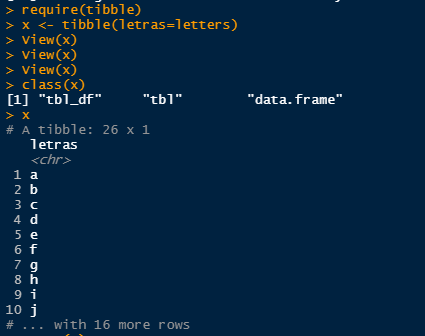
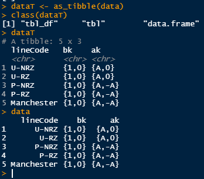
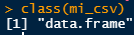
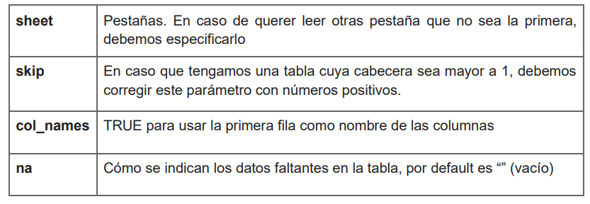

# Gestión de Datos R

El **pre-procesamiento** de datos es una parte vital para ordenar, limpiar, catalogar, y 'pulir' los datos, para su procedente manipulación. Antes de crear cualquier algoritmo de procesamiento, los datos deben estar en un formato correcto, normalizados, entre otros.

A estas actividades de **pre-procesamiento** o también llamado **proceso ETL (Extracción, Transformación y Carga de Datos)** tendrán la función de integración de datos. Cuando se tiene datos extraídos de múltiples fuentes, es ideal:

1. Limpiarlos

2. Validarlos (Cada dato se lo evalua de acuerdo a su contexto y a su sentido)

3. Normalizarlos (Estandarizacion de columnas similares en un solo formato)

4. Transformarlos 

5. Almacenarlos


## ETL

Extract - Transform - Load es una herramienta que nos ayuda en el Data Mining que extraeremos de algun lugar los datos, los transformaremos y lo vamos a guardar/cargar en otro repositorio. Esto se lo realiza 

El proceso de ETL se aplica para casos de:

1. Procesos Operativos

2. Construcción de almacenes de datos

3. Análisis de Redundancia

4. Migración de datos de una aplicación a otra.

El ETL también se puede realizar en tiempo real, donde de acuerdo a una base de datos dinámica (constantemente alimentada) el proceso de transformación se realice diariamente, semanalmente, etc. De manera que se lo pueda guardar en un DataWareHouse después y usarlo en consultas, procesos, etc. Es de mencionar que el ETL es flujo de pasos.

Existen software que permiten automatizar este proceso, son los llamados `Data Pipelines`, en la ciencia de datos, los que se encargan de este paso son los Ingenieros de Datos.  Recuerda el `pipe operator` del interprete de un S.O, este operador permitía que el `stdout` de un comando fuera el `stdin` de otro, de ahí el termino `pipeline`.

#### PipeLines Software

[Amazon Data Pipeline: servicio ETL administrado (Amazon Web Services)](https://aws.amazon.com/es/datapipeline/)

## Niveles de Calidad y Depuración de Datos

Podemos hablar de 3 niveles de calidad de datos:

### Datos en Bruto (RAW Data)

Datos en su estado inicial, que  no se ha sometido a ningún procesamiento y auditoria, son datos de **origen**. Pueden ser archivos, imágenes visuales, muestras de señales digitales, registros de base de datos u otro dato digital.

En cuestión de registros tabulados, los datos en bruto pueden venir sin encabezados, codificados con caracteres desconocidos o inesperados, desordenados, mal etiquetados, datos NA (No aviable), errores de tabulación, etc.

### Datos técnicamente correctos

Pueden ser leídos en un dataframe, con encabezados correctos, pero pueden existir datos con un formato no correspondiente al contexto de los encabezados. Por ejemplo edades negativas, tuplas repetidas, incoherencias entre tuplas, etc.

Estos complicaciones deben ser solucionadas antes de realizar cualquier proceso de inferencia estadística.

### Datos Consistentes

Los datos se encuentran en optimas condiciones para realizar cualquier procesamiento estadístico tanto descriptivo como inferencial. Este es el punto de partida para utilizar cualquier teoría estadística.

Hay que recordar que si encontrase con datos perdidos, estos influirán el procesamiento global, por ende, una solución podría ser eliminar la tupla, o realizar una interpretación en el análisis.

**Esquema de trabajo en la ciencia de datos.**


Para la representación en tabla de la información.

1. Se realiza la lectura de los datos que se requiere importar en R.

2. Se ordenan las columnas de acuerdo a su tipo de variable y las tuplas correspondientes.

3. Se realiza la transformación. Incluye un **análisis exploratorio** de los datos, normalizando la tabla, creando nuevas variables en función de las existentes (sumas, operaciones algebraicas). Calcular un conjunto de estadísticas resumen.

4. La visualización de los datos en (se refiere a texto plano) nos ayudara a comprender de mejor manera, por ejemplo: la presentación de una variable que es un numero decimal, lo optimo seria presentarlo con dos cifras decimales.

5. Se debe crear un buen concepto de resultados, estos deben comunicar algo acerca de los datos transformados.

# Tidyverse en Ri

`TidyVerse` es un conjunto de paquetes para la manipulación y estructuración de datos.

Estos paquetes nos ayudaran a `importar datos`, colocarlos en un `formato ordenado` (tidy), buscar relaciones entre ellos, transformar, visualizar y con la creación de modelos. El tidyverse nos ayuda tambien a manipular datos de tipo fecha, cadenas de caracteres o factores.

**Instalación de Tidyverse**

```R
install.packages("tidyverse")
```

**Cargar tidyverse**

```R
library(tidyverse)
```

El tidyverse contiente ocho paquetes principales que se los puede catalogar como Basicos e Intermedios:

**Básicos**

➡️ **ggplot2** (Visualizacion, Graficas y demas)

➡️ **dplyr** (Transformaciones, Crear nuevos atributos seleccionando, filtrando sumando, acomodando, mutanto los datos existentes)

➡️ **tidyr** (Estandarizacion de Tablas)

➡️ **readr** (Para importar archivos de texto plano)

➡️ **readxl** (Para importar archivos de excel)

**Intermedios**

➡️ **purr** (Trabajo con Vectores y Funciones)

➡️ **tibble** (Viene a ser una transformación del data frame)

➡️ **stringr** (Es un paquete para trabajar con un análisis de texto y manipulación de strings en casos.)

➡️ **forcats** Generación de factores y datos categóricos.

Para conocer los paquetes que trae nuestra libreria de tidyverse, utilizamos:

```R
tidyverse_packages()
```

## Tibble Package


Tibble es un generador de dataframes, que contiene mejoras que los generados por `data.frame` nativo de R. El tipo de dato generado por `tibble()` es de tipo `tbl_df`, definida por observaciones x variables. Me mostrara únicamente los primeros 10 registros/filas.

```r
require(tibble)
x <- tibble(letras = letters)
class(x)
x
```



El uso de `tribble` en una manipulación manual de tablas pequeñas, por ejemplo, para definir encabezados/atributos lo hacemos con la virgulilla `~`, y los valores vienen separados por comas.

Parámetros de frecuencia de receptores de radio AM y FM.

```r
tribble(
    ~frecuencyIF, ~service, ~bandwidth,
    455e3,"FM",200e3,
    10.7e6,"AM",10e3,
)
```


Otra función del paquete `tibble` a conocer seria `as_tibble()`, estos forzaran la transformación de los data.frame nativos de R a dataframes obtenidos del tidyverse.

```r
lineCode <- c("U-NRZ","U-RZ","P-NRZ","P-RZ","Manchester");
bk <- c("{1,0}","{1,0}","{1,0}","{1,0}","{1,0}");
ak <- c("{A,0}","{A,0}","{A,-A}","{A,-A}","{A,-A}");

data <- data.frame(lineCode,bk,ak)
```


```r
dataT <- as_tibble(data)
```



Ya con esto, podremos ingresar a los valores como cualquier dataframe, por ejemplo:

```r
data[,2]
## [1] "{1,0}" "{1,0}" "{1,0}" "{1,0}" "{1,0}"
data[1,]
## 1    U-NRZ {1,0} {A,0}
head(data)
## 6 primeros datos
view(data)
## Observamos toda la data en una hoja de calculo en R
nrow(data)
## [1] 5       Numero de filas
ncol(data)
## [1] 3       Numero de Columnas
dim(data)
## [1] 5 3     Dimensiones del DataFrame
```


# Importación de datos

Para el análisis de datos, siempre se estará trabajando con hojas de cálculo, o con archivos de texto plano, ya sean en formato xls, dbl, csv, txt, dat, etc. Debemos tener en cuenta que antes de realizar la importación, se haya hecho una inspección y una auditoria de los atributos para evitar problemas en la lectura de hojas de calculo, ademas ya completada el proceso de importación, estos seran manipulados como si fuesen `data.frame` nativo de R.

+ La primera tupla que se encuentra suele usarse para los atributos/encabezados.

+ La primera columna se suele utilizar para representar la unidad de **muestreo**. Es decir aquí se encontrara la secuencia temporal, serie temporales o fechas.

+ Se escoge la metodología para nombrar tabla SQL para los encabezados, ya sea colocando un "." o un "_" para concatenar palabras, pero nunca usar espacios.

+ De ser prioritario simplificar los nombres de los encabezados, de ser posible usar acronimos.

+ La hoja de calculo debe libre de comentarios y otros typo que existan, para evitar columnas adicionales o NA al archivo que se va a importar.

+ Los datos nulos o faltantes deben ser homogéneos a lo largo del documento, se puede utilizar NA, d/f,df,-,9999.

En la inspección de los datos, lo conveniente seria abrirlo con `nano`,`vim`, `cat` u otro visor de texto. Esto para observar características de mi archivo de texto plano. Por ejemplo deberíamos observar:

1. **Carácter separador**  (coma, punto y coma, etc)

2. **Caracter para identificar el decimal** (Punto o coma)

3. **Formato de datos faltantes** (Uso de NA, d/f,df)

4. **Numero de filas**

La importación de un tabla en .csv podremos realizarlo con:

```r
read.table() # separado por comas
read.csv() # Separado por comas
read.csv2() # Separado por punto y coma
```



El comando mas versatil es `read.table()`, esta usara una serie de atributos con los cuales trabajara para funcionar.


Para cargar nuestro archivo de texto plano .csv, utilizamos

```r
my_csv <- read.table("./netflix.csv", header = TRUE)
```

Para cargar un archivo de excel, lo hacemos con:

```r
read_excel()
read_xls()
read_xlxs()
```



Hay que recordar que este archivo tendremos no solo una hoja de texto, sino que un libro de hojas de calculo.

```r
mi_excel <- read.excel("netflix.xls", col_names = TRUE)
head(mi_excel)
```

#### Lista de Referencias

[Pipelines | Kaggle](https://www.kaggle.com/code/alexisbcook/pipelines)
